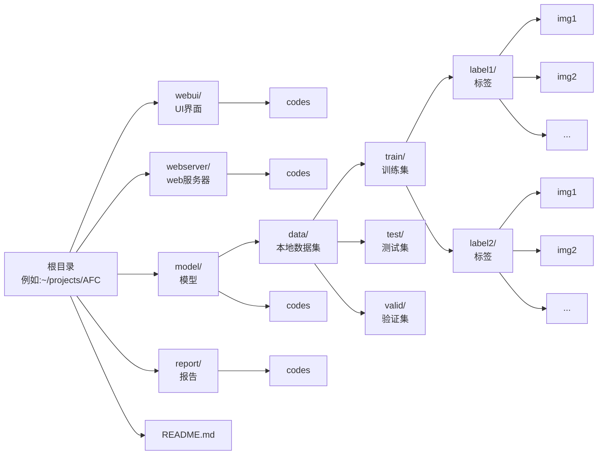

# 基于卷积神经网络的AI(or not)人脸分辨

## 数据集

数据集来自开源社区 *hugging face* :[deepfake_face_classification](https://huggingface.co/datasets/pujanpaudel/deepfake_face_classification).

## 项目环境

### 所用包

`python=3.14.0`,`torch=2.9.1+cu128`, `requests`, `tkinter`

### 环境配置

1. 以下以`conda`为例,其他环境管理方式自行使用
2. `` conda create -n <environment name> python=3.14 ``
3. `` conda activate <environment name> ``
4. `` conda install pip ``
5. `torch`库安装参考:
    - [pytorch官网](https://pytorch.org):`` pip insatll torch torchvision ``
    - 推荐[阿里云镜像](https://mirrors.aliyun.com)`` pip install torch torchvision -f https://mirrors.aliyun.com/pytorch-wheels/cu128 ``(阿里云镜像可以很方便地通过修改链接中的 *cu128* 来控制版本)


## 版本控制

使用`git`进行版本控制.


0. 初始化步骤
   - 在Github中fork核心仓库
   - 在`bash`中依次执行下列命令
   ```bash
   # 克隆fork仓库到本地
   git clone https://github.com/<username>/<forkRepoName>.git
   cd <forkRepoName>
   
   # 添加核心仓库为 upstream
   git remote add upstream https://github.com/NH-5/AFC.git

   # 验证 remote 配置
   git remote -v
   # 应显示 origin（你的）和 upstream（核心仓库）
   ```
1. 假设开发新`feature`,需要先创建新分支`feature/new-feature`
    ```bash
    # 切换到主分支
    git checkout main

    # 拉取核心仓库最新代码
    git fetch upstream
    git reset --hard upstream/main  # 用核心仓库覆盖本地

    # 推送核心仓库最新代码到你的 Fork（保持同步）
    git push origin main --force

    # 创建新分支（不要在 main 上开发）
    git checkout -b feature/new-feature
    ```
2. 开发完成后工作
    ```bash
    # 提交
    git add .
    git commit -m "<commit内容>"

    # 推送到你的 Fork
    git push -u origin feature/new-feature
    ```
3. 网页端提交PR,**记得at我**
4. PR合并后清理本地开发用分支
    ```bash
    # 删除本地分支
    git checkout main
    git branch -d feature/new-feature

    # 删除远程分支
    git push origin --delete feature/new-feature
    ```

## 文件结构

<!--
以下是字符树形式的文件结构
```text
    根目录(例如~/projects/AFC)
    |-- webui/            #UI界面
    |   |-- code
    |-- webserver/        #web服务器
    |   |-- code
    |-- model/            #模型
    |   |-- data/         #本地数据集
    |   |   |-- label1/   #标签
    |   |   |   |-- img1
    |   |   |   |-- img2
    |   |   |   |-- ...
    |   |   |-- label2/
    |   |   |   |-- img1
    |   |   |   |-- img2
    |   |   |   |-- ...
    |   |-- code
    |-- report/           #报告
    |   |-- code
    |-- README.md
```
-->


训练集,测试集,验证集有相同的结构.